# Architecture overview — services, trust boundaries, and data flow

This is the visual entry point to VidAIO. It explains what runs where, which data is
trusted, how a miner output becomes a weight, and how that result can be reproduced on
an ordinary CPU. [VALIDATING.md](VALIDATING.md) covers the operational side of running
a validator against this topology.

## Release snapshot

| Area | State |
|---|---|
| Two-track inference, competition scoring, deterministic weights | Implemented and CI-covered |
| CPU-only own-audit and beacon-audit; findings are report-only | Implemented and CI-covered |
| Control/service topology and GPU-backed miner ingress | Central CPU plane on the authority hosts; one independent CPU/TLS miner-edge host per miner identity |
| Public testnet registrations, live S3/IAM, archive RPC measurements, alert delivery, soak | Proved in the live testnet run and soak |
| Mainnet release | Released — live on netuid 85 after the successful testnet soak |

This distinction matters: the repository can prove deterministic behavior locally, but
only a real deployment can prove credentials, network paths, chain cadence, GPU runtime,
and operational alerting together.

## 0. What this subnet does

VidAIO (Bittensor subnet 85) rewards two video tasks:

- **Compression** — reduce the encoded size while retaining useful visual quality.
- **Upscaling** — reconstruct a higher-resolution result from a degraded miner input.

Those tasks run in two economic arenas:

- **Inference** continuously challenges registered miners and folds their round results
  into an EWMA. Its pool is 80% in IDLE, 60% in a PODIUM window, and 10% in a
  CROWN window. Inside that pool the compression/upscaling split stays 0.8/0.2.
- **Competition** executes submitted solutions in isolated GPU sandboxes. The latest
  successfully applied global result opens one seven-day half-open reward window:
  40% goes to its podium without a breakthrough (PODIUM), or 90% goes to the podium
  when rank one beats the archived executable baseline by at least 5% (CROWN). Outside
  a window, competition receives zero and the protocol sends IDLE's fixed 20% to the
  canonical non-earner sink.

The invariant underneath both arenas is:

> Every number that can change emissions must be independently recomputable from
> durable evidence on CPU.

GPU miners may produce outputs, and competition sandboxes may execute solutions on GPU.
They do not get to produce an opaque, trusted score. The authority computes the score
with the release-locked CPU scoring stack, and auditors independently replay that same
calculation on CPU.

## 1. Logical system map

Measurement and finalization plane:

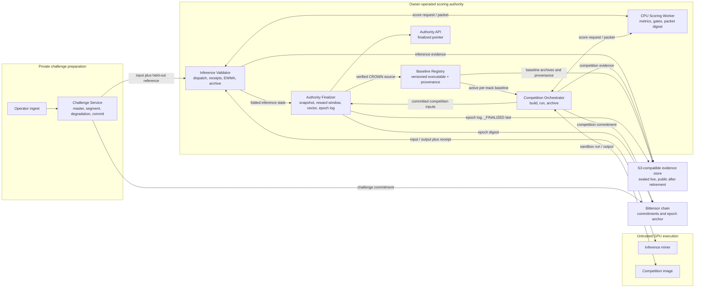

Validator and reporting plane:

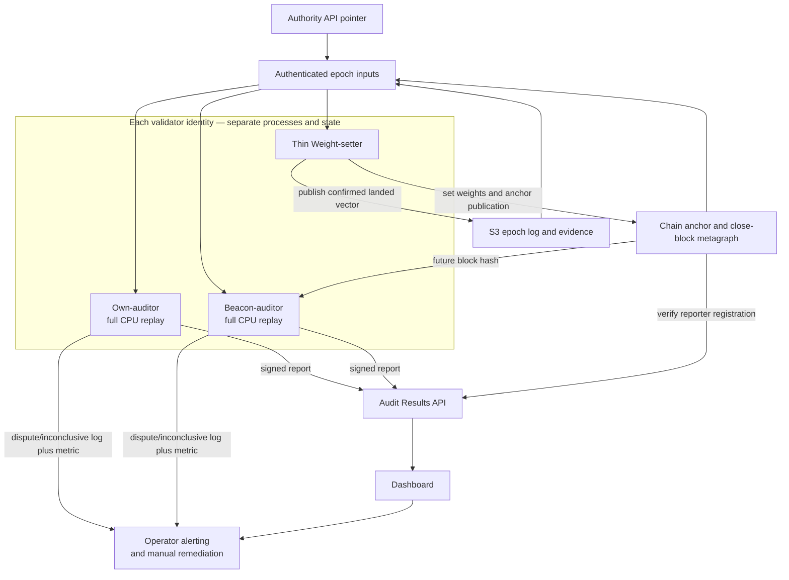

Three separations in this diagram are intentional:

1. The pristine reference never goes to a miner. The validator receives it through a
   trusted challenge handoff and supplies it only to the scorer and evidence archive.
2. The scoring worker is stateless with respect to durable evidence. The inference
   validator archives inference artifacts; the competition orchestrator archives
   competition artifacts.
3. Auditors report to the Audit Results API and operator alerting. They have no control
   edge into the weight-setter.

The optional customer-serving plane is omitted here to keep the consensus path legible;
its separate registry and gateway relationship appears in the competition section.

## 2. Compute and trust boundary

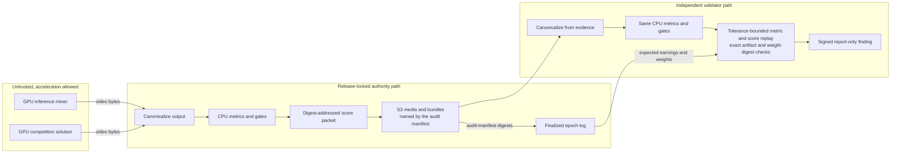

At launch, PieAPP and every other payout-affecting metric are pinned to CPU. A future
GPU scorer is acceptable only if its output is evidence, not authority: a CPU auditor
must still reproduce the earned score within the release-locked tolerance.

## 3. The two scoring lanes

Both tracks enter one canonical scoring contract, but their transformations and gates
are different. The anti-gaming quality delta is measured against the **miner input**,
not against an unrelated pristine-reference baseline.

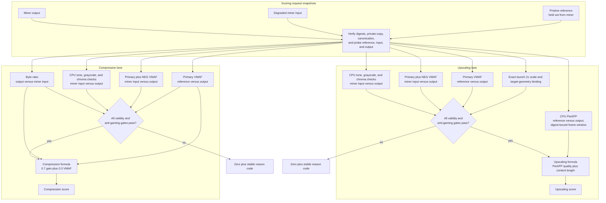

The audit comparison uses tolerance hysteresis at a gate boundary: tiny permitted
metric drift may not flip an authority pass into an audit failure. Away from a boundary,
scores and derived earnings remain strict and deterministic.

## 4. Deployed topology

The deployed stack deliberately runs trust boundaries as separate containers,
with separate state directories, health checks, and metrics endpoints.

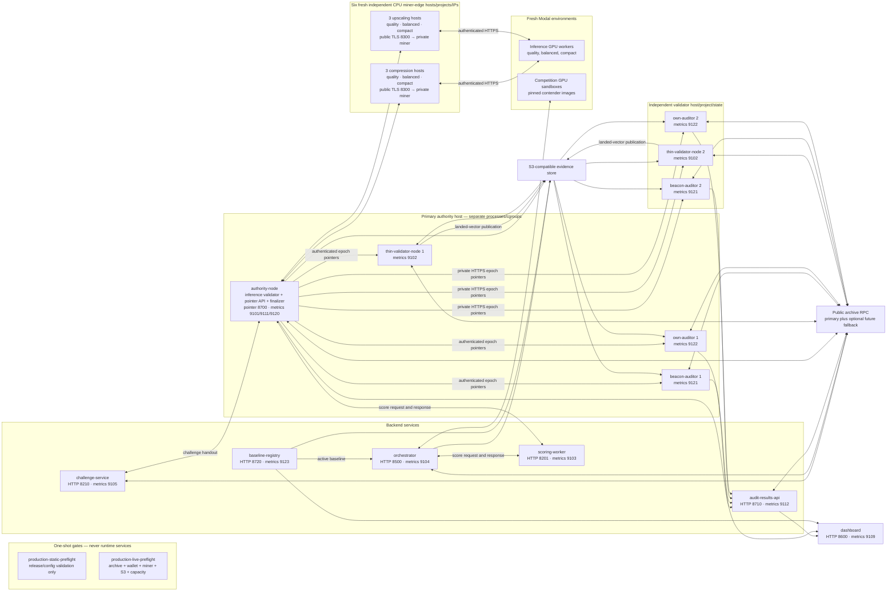

The primary authority host runs no earning miner and has no local-miner startup
dependency. Each reference miner identity runs the same parameterized miner-edge
composition on a fresh host/public IPv4 address: one hardened CPU
miner ingress plus its containerized IP-SAN TLS edge. The ingress authenticates and bounds
artifact-v2 transport, delegates media transformation to a fresh Modal GPU worker, and
never scores. Scoring and every audit recomputation remain in ordinary CPU services. This
host/IP isolation is economically load-bearing because reward dedup is global by
advertised IP before track ranking.

The product gateway, optional product-serving selection worker, champion backend, and
autoupdater are product/operations components, not required containers in the
consensus stack. The executable-baseline registry is different: current schema-v15 earning
competitions require it. Absence of the optional product components must not be mistaken
for a missing scoring or emissions path.
`production-static-preflight` and `production-live-preflight` are distinct one-shot
profiles. Only the latter has the exact `--live`, 7,200-block archive-depth, and real
miner identity/URL arguments. Neither starts, owns, or depends on the runtime services
drawn beside it.

## 5. Service ownership

| Service or role | Primary code | Owns durable state | Responsibility |
|---|---|---|---|
| Challenge Service | owner-operated, not in this repo | Challenge catalog, immutable segment manifests, and sealed-source metadata | Ingest, duplicate screening, lossless master, per-track duration eligibility, constrained winnable DAG draw from the selected segment, commit before dispatch |
| Inference Validator | `vidaio/validator/` | Round state and inference evidence | Census-aware dispatch, signed artifact-v2 transport, deadlines, receipts, duplicate resolution, miner-attributable zeroes |
| Scoring Worker | `vidaio/scoring_worker/`, `vidaio/scoring/` | None beyond process telemetry | Stateless CPU canonicalization, metrics, gates, score packet generation |
| Competition Orchestrator | `vidaio/competition/` | Competition state and competition evidence | Enrollment, reproducible build, isolated GPU run, per-subject scoring, evidence matrix, and lifecycle |
| Authority Finalizer | `vidaio/authority/`, `vidaio/epoch/` | Epoch working state, then immutable S3 log | Snapshot already-folded EWMA, independently check the fold, derive economic order and the global reward window, dedup/payouts, predecessor link, finalization and chain anchor |
| Scoring Authority API | `vidaio/authority/service.py` | No alternate copy of the log | Serve the latest finalized pointer and expected digest |
| Thin Weight-setter | `vidaio/weightsetter/` | Submission cursor, accepted intent, and landed-vector publication state | Authorize exact epoch-log bytes, submit safely, publish the confirmed landed vector, recover from chain/RPC uncertainty |
| Own-auditor | `vidaio/auditor/`, `vidaio/audit/` with `audit_mode=own_audit` | Its own cursor, signed-report outbox, logs | Full CPU replay on its own cadence; report only. The legacy `vidaio/weightsetter/own_audit.py` helper is not production wiring. |
| Beacon-auditor | `vidaio/auditor/`, `vidaio/audit/` with `audit_mode=beacon` | Its own cursor, signed-report outbox, logs | Full CPU replay bound to a post-finalization beacon; report only |
| Audit Results API | `vidaio/audit_api/` | Signed findings keyed by auditor, epoch, and mode | Central append-only investigation record |
| Dashboard | owner-operated, not in this repo | Presentation/cache state only | Surface health, metrics, findings, chain-confirmed published weight history, and the effective reward window; keep the executable-baseline registry visibly distinct |
| Baseline registry | `vidaio/registry/` | Per-track immutable executable versions and promotion latch | Seed each track with archived baseline v0; activate only an independently verified CROWN winner; serve the active baseline beyond its reward window |
| Serving registry | `vidaio/registry/` | Optional product-serving selection | Select what the optional product gateway serves; separate from reward-window economics and the executable-baseline ratchet |
| Gateway | owner-operated, not in this repo | Product-plane job state | Route organic customer jobs; outside the consensus loop |
| Reference miner ingress | `vidaio/miner/` | Miner-local model and task state | Authenticated artifact-v2 endpoint around a replaceable private backend |
| Autoupdater | `vidaio/autoupdater/` | Version observation state | Report release/version state; it does not silently redefine consensus behavior |

## 6. Life of one finalized epoch

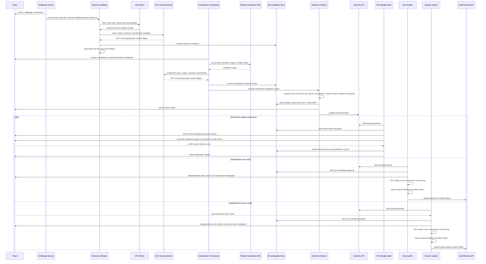

For DISPUTED or INCONCLUSIVE results, each auditor emits a structured CRITICAL/WARNING
log and metric suitable for external alerting before central delivery. Every signed
report is persisted in a durable outbox and retried, so an unavailable Audit Results API
cannot erase a finding. Audit status cannot interrupt scheduled weight submission:
investigation and remediation are manual operator actions.

## 7. Evidence and anchoring graph

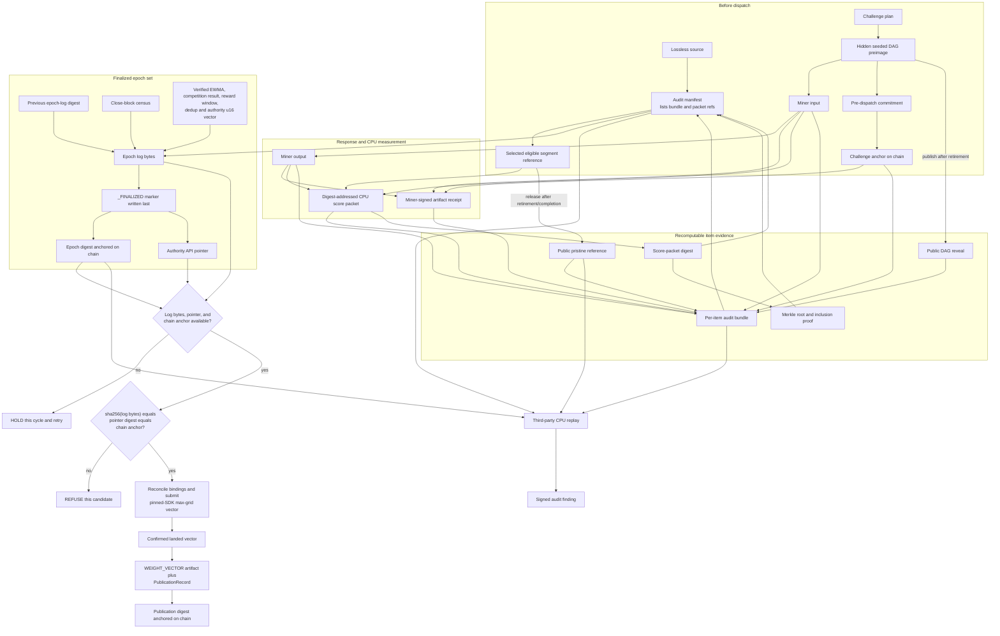

The weight-setter authenticates the log with the equality
`sha256(epoch_log_bytes) == pointer_digest == on_chain_anchor`. It can also defer for
ordinary safety conditions such as an unavailable archive RPC, an unfinalized or empty
log, an unparseable payload, wrong tempo, or unresolved chain intent. Those are chain
submission safeguards, not audit enforcement.

The left side depicts an inference item. A competition item replaces the degradation-DAG
reveal with its manifest-committed `(input digest, reference digest, 2x factor,
target width, target height)`
binding and becomes publicly recomputable when the completion gate releases its pristine
reference.

The authority log commits `weight_u16` on VIDAIO's deterministic **sum-grid**. It is not
the runtime wire representation. The real chain adapter first verifies every positive
`(uid, hotkey)` target against a fresh metagraph. A deregistered or recycled UID rejects
the complete attempt before any write: it is neither paid to a new occupant nor removed
and renormalized into survivors. With the exact target set verified, pinned Bittensor
10.5 emits the deterministic **max-grid** vector, exactly
`max_normalize_u16(epoch_log.weight_u16)`. The confirmed max-grid vector—not the
authority sum-grid—is what gets durably published and anchored. Consequently the epoch
log's weight-vector digest and the post-submit publication digest normally differ, but
their mapping is deterministic and independently testable.

## 8. Mutable state and system of record

| State | System of record | Recovery property |
|---|---|---|
| Challenge ingest, plans, and sealed-reference metadata | Challenge Service database plus configured secret material | A restart cannot silently redraw an already committed challenge |
| In-flight inference rounds | Inference Validator state | Deadlines and receipts survive process restart |
| Competition lifecycle | Orchestrator database | State transitions are explicit and resumable |
| Inputs, outputs, references, packets, manifests, epoch logs | S3-compatible bucket, versioned/locked by deployment policy | Content digests, retention policy, and `_FINALIZED` written last |
| Epoch authenticity | Bittensor chain anchor | Independent validators bind downloaded bytes to an immutable digest |
| Weight submission | Chain plus weight-setter cursor/accepted intent and S3 publication | Retry safely; publish only the vector confirmed to have landed |
| Own-audit and beacon-audit progress | Separate auditor cursors and outboxes | One mode cannot advance, overwrite, or suppress the other |
| Audit findings | Signed report in a durable outbox, structured log/metric, then Audit Results API | Central outage delays delivery but does not lose the signed report |
| Release identity | Git tree plus `data/ci-pass` | Deployment preflight proves CI ran on the exact shipping source tree |

## 9. Weight setting and audit findings are independent

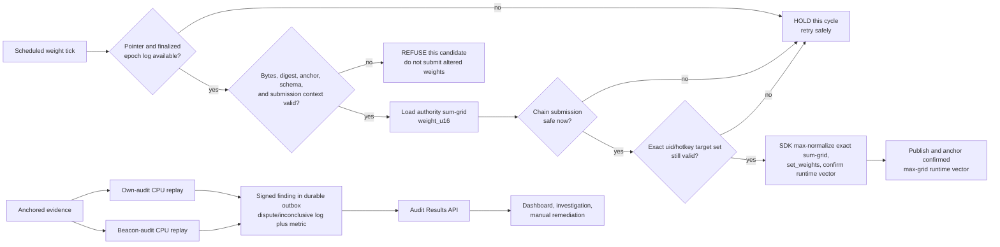

There is deliberately no arrow from `REPORT` back into `SET`. Validators always attempt
to set the authority-derived vector on schedule once the epoch itself is authentic and
the chain operation is safe, subject only to the mandatory current `(uid, hotkey)`
exact-target check described above. Audit results inform people; they do not automatically
freeze the fleet or rewrite emissions.

## 10. Competition, reward-window, and executable-baseline lifecycles

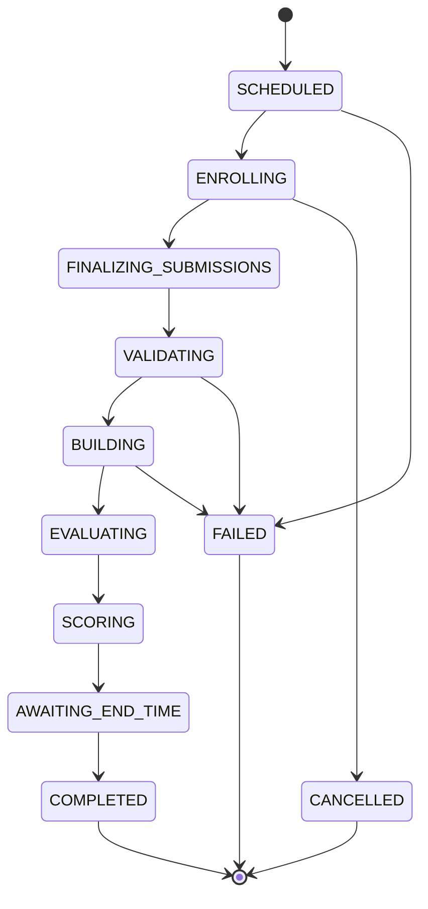

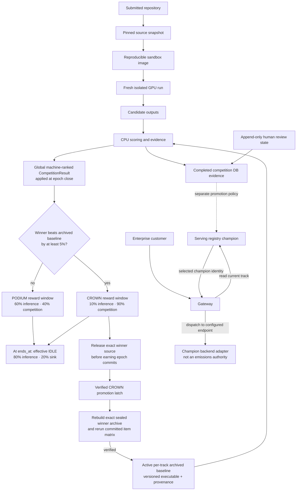

The economic podium and reward state are derived entirely from committed machine
evidence; human review cannot change the economic rank. There is one global reward
window: every successfully applied newer cycle replaces any older window and starts a
new half-open interval `[applied_at, ends_at)`. Production fixes that duration at 168
hours; a testnet-only override may shorten it so both activation and expiry can be
observed. PODIUM and CROWN both pay the result's top three at 70/20/10 within the fixed
competition pool. Missing or deregistered ranks are not redistributed; their shares go
to the canonical sink.

The executable ratchet is a distinct per-track state machine. Each track starts with an
archived public reference implementation at baseline v0. Only a fully verified CROWN
winner can replace that track's active baseline, after the exact sealed submission is
released before the earning epoch commits, then rebuilt and rerun against the committed
matrix. The active executable remains the
baseline after its seven-day payout window expires. A separate product promotion policy
may decide what an optional customer gateway serves; neither serving choice nor human
review can alter emissions.

Test deployments enroll known example contenders and create only fresh GPU resources
whose names start with `vidaio-next-`; teardown removes those resources when the run is
finished.

## 11. Where emissions go

The latest global reward state selects fixed pools. The inference pool always preserves
the 0.8/0.2 compression/upscaling split; the competition pool always uses the result's
70/20/10 podium.

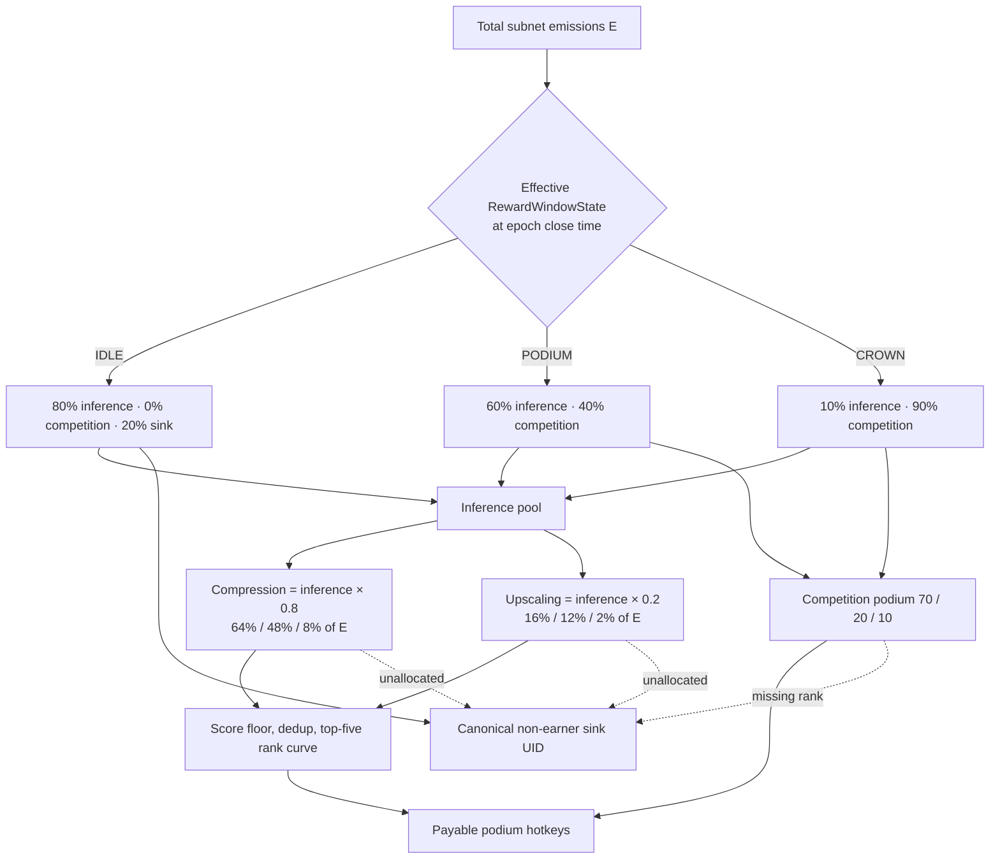

Inference eligibility is not “whoever showed up gets a full share”:

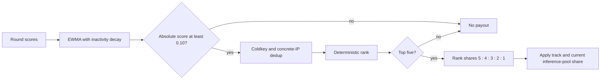

Unspecified advertisement addresses (`0.0.0.0` and `::`) are exempt from IP dedup so
miners without a serving axon do not collapse into one identity. A concrete shared IP
is deduped, as is a shared coldkey. Coldkey collusion and reliance on one CPU PieAPP
implementation are explicitly accepted launch risks.

## 12. Failure isolation

| Failure | What stops | What continues |
|---|---|---|
| Miner timeout or invalid output | That miner item receives its deterministic result/zero | Other miners and tracks finish the round |
| Scoring worker unavailable | Affected scoring items are non-punitively skipped/not accumulated | Other services and existing immutable evidence remain available |
| Per-item S3 evidence write fails | That item cannot enter the economic fold | Other evidence and rounds remain intact |
| Epoch-log S3 write or finalization fails | The epoch is not advertised or anchored as complete | Previous on-chain weights remain in effect |
| Authority API unavailable | Weight-setter and both auditor discovery loops retry because they cannot authenticate a new pointer | Previous weights and already stored evidence remain intact |
| Archive RPC unavailable or rate-limited | Chain-dependent preflight, anchoring, or submission retries safely | No fabricated census, anchor, or weight vector is accepted |
| Own-audit or beacon-audit FAIL/INCONCLUSIVE | A signed finding, structured log, and metric are emitted; provisioned monitoring may alert | Scheduled authenticated weight submission is not interrupted |
| Audit Results API unavailable | Central delivery waits in the signed-report outbox | Structured logs/metrics persist; weight setting continues |
| One auditor mode crashes | That mode restarts from its own cursor | The other auditor and weight-setter remain independent |
| GPU sandbox or contender build fails | That contender/competition follows its explicit failure transition | Inference scoring and finalized prior epochs continue |
| CROWN baseline promotion build/rerun fails | The per-track promotion latch remains pending and the prior executable stays active | The already anchored reward window and weight-setting continue; the next competition for that track waits for remediation |

## 13. Known seams and accepted launch risks

- The live public-testnet run validated S3 policy/IAM, cursor-floor genesis,
  wallet registration, archive-RPC rate limits versus anchor cadence, miner
  advertisements, real Modal GPU behavior, alert delivery, and a multi-epoch soak
  before release.
- The serving `ChampionBackend` and self-service product routing are not consensus
  dependencies and are not treated as complete merely because competition emissions
  are live.
- Coldkey-level collusion and a single-model CPU PieAPP metric are accepted launch
  risks rather than hidden claims of solved problems.
- Competition is earning live. The epoch log commits the exact pre-enrollment raw
  commitment receipt (subnet, payload/digest, inclusion/hash, and finalized height), and
  authority/auditors independently archive-read it, alongside the full item matrix and sealed contender
  archives, the archived baseline executable and provenance, every packet/bundle, the
  chain-time `applied_at`, global cycle, `CompetitionResult`, and `RewardWindowState`.
- Mainnet deployment was gated on the real testnet evidence and soak, not only on
  local CI.

## 14. Deeper reading

- the project design record — why validators land byte-identical weights
- [VALIDATING.md](VALIDATING.md) — validator deployment and operating behavior
- The per-package `README.md` files under `vidaio/` — service-level contracts
  (weight-setter, auditor, authority, audit API, epoch schema)
